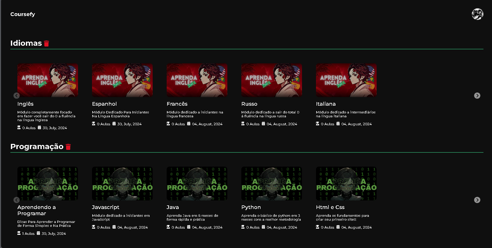
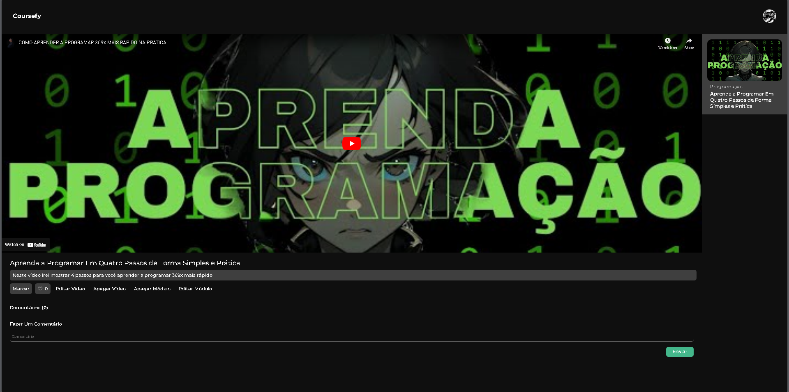
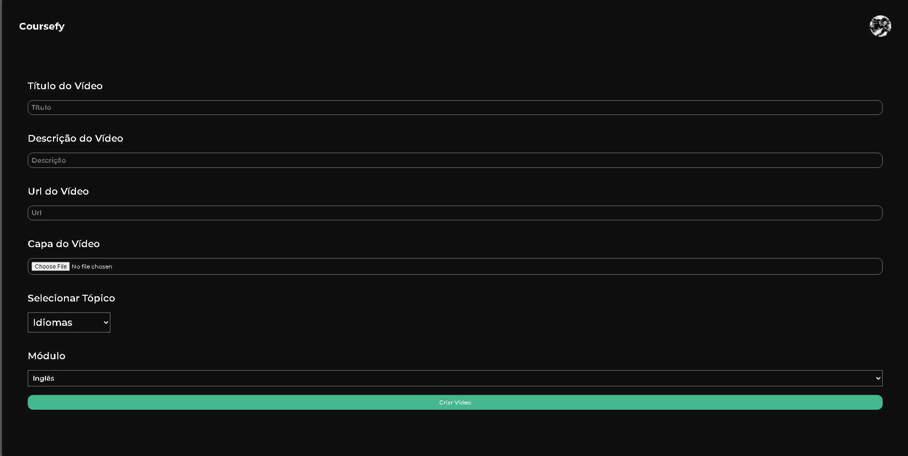

# PROJETO-DJANGOFY

## ClearMind


This project was developed to help you create your own course with many features similar to other professional course platforms.

With a beautiful design inspired by Abraham's course named "Editor Zen," you'll have a wonderful experience!

## Links

- [Project](https://coursefy.pythonanywhere.com/)

## Home Layout



## Video Detail Layout



## NewVideo Layout



## NewTopic and NewModule Layout


## Conceptual Model

The conceptual model of ClearMind is structured as follows:

### 1. Course
- Contains multiple **Topics**.

### 2. Topic
- Contains multiple **Modules**.

### 3. Module
- Contains multiple **Videos**.

### 4. Video
- Can have multiple **Comments**.
- Can be marked as **Completed** or **Not Completed**.
- Can be **Liked** or **Not Liked**.

### 5. Comment
- Associated with a **Video**.
- Created by a **User**.
- Can be **Responded to** by the **Course Owner**.

### 6. User
- Can create **Comments**.
- Can mark **Videos** and **Like** or **Dislike** the **Videos**.

### Relationships

- A **Course** has many **Topics**.
- A **Topic** has many **Modules**.
- A **Module** has many **Videos**.
- A **Video** can have many **Comments**.
- **Users** interact with **Videos** through marking and liking.
- **Comments** can be responded to by the **Course Owner**.

## Features

### Authentication

- **Account Login:** Allows users to authenticate in the application.
- **Account Register:** Enables new users to create an account.

### Topics, Modules, and Videos

- **CRUD:** Allows the course owner to create, edit, and remove topics, modules, and videos.

### Video

- **To Check and Like Video:** Allows marking the video as completed or not completed, and to like or dislike the video.

### Comments

- **Comment:** Enables users to create a comment on a video and the course owner to respond to the comment.

### User

- **Profile Image:** Enables users to change their profile image.
- **Password:** Enables users to change their password.
- **Username:** Enables users to change their username.

## Technologies Used

### Back-End
- Python
- Django
- JavaScript

### Front-End
- HTML
- CSS
- JavaScript

### Deploy
- Back-End: PythonAnywhere
- Front-End: PythonAnywhere
- Database: MySQL/PythonAnywhere

## Run Project

### Prerequisites
- Python 3.11

```bash
# Clone Repository
git clone https://github.com/V1KILL/PROJETO-CLEARMIND.git

# Activate Virtual Environment
.\venv\Scripts\activate

# Activate Virtual Environment (Linux)
source venv/bin/activate

# Install Dependencies
pip install -r requirements.txt

# Apply Migrations
python manage.py migrate

# Start the Server
python manage.py runserver
